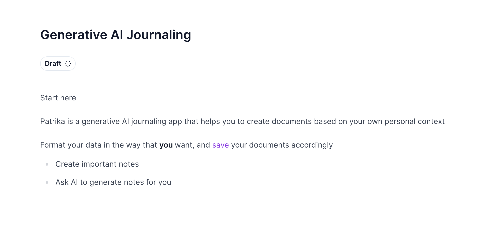

# Patrika

Patrika is an open-source generative AI journaling app designed to help users effortlessly create journal entries using techniques like RAG (Retrieval-Augmented Generation)



### Features

**AI-Powered Journaling**: Utilizes RAG to generate insightful and personalized journal entries based on prompts and context provided by the user

**Firebase Authentication**: Securely manages user authentication and data storage using Firebase Authentication, ensuring reliable access control

**Document Management**: Enables users to create, view, edit, and delete journal entries seamlessly within the app

### Tech Stack

This project would not be possible without the many cool open projects that it is composed of:

- [Novel](https://github.com/steven-tey/novel)
- [shadcn/ui](https://ui.shadcn.com/)
- [Langchain](https://www.langchain.com/)

Other integrations:
- [Firebase](https://firebase.google.com/)

## Installation and local development

### Docker

Work in Progress: Coming soon

### Server

Move to the server folder from the project root directory:

```bash
cd server
```

Make sure you have [poetry](https://python-poetry.org/) installed on your system
Then install project dependencies with:

```bash
poetry install
```

Add the firebase service key json to the root of your project directory as `firebase.json`

You will have to install additional dependencies like [poppler](https://poppler.freedesktop.org/) and [tesseract](https://pypi.org/project/pytesseract/) to make sure PDF extraction works as expected

Then run the langchain / langserve server with

```bash
poetry run langchain serve
```

### Client

Running the client is relatively simple
Move to the client folder from the project root directory:

```bash
cd client
```

Install dependencies with the package manager of your choice, I've used bun here:

```
bun install
```

Clone the contents of the `.env.sample` file into `.env`, then populate them with the relevant firebase credentials as well as the API url

Run the local development server with:

```bash
bun dev
```

### Database

Currently I run a postgresql database with the PGVector extension in a docker container like so:

```bash
docker run --name pgvector -e POSTGRES_HOST_AUTH_METHOD=trust -p 5432:5432 -d ankane/pgvector
```

This is okay for local development. This README will be updated in the future with a guide to do this with a local postgresql database

## Contributing

This project currently does not have a defined contribution guide, but contributions are very much welcome! Please follow these guidelines:

- Fork the repository and create your branch from main.
- Open a pull request with a clear description of your changes.
- Ensure your code follows the project's coding style and conventions.
